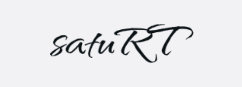
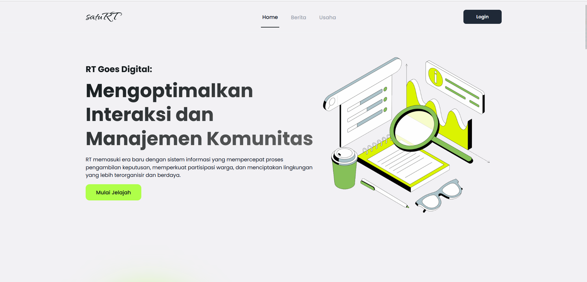

<a name="readme-top"></a>
[![Contributors][contributors-shield]][contributors-url]
[![Forks][forks-shield]][forks-url]
[![Stargazers][stars-shield]][stars-url]
[![Issues][issues-shield]][issues-url]

<br />
<div align="center">
  <a href="https://github.com/Eddav29/satuRT">
    
  </a>

  <h3 align="center">SatuRT</h3>

  <p align="center">
    Welcome to SatuRT! This project aims to optimize interaction and management within neighborhood associations (Rukun Tetangga) by providing a comprehensive website with various features. 
    <br />
    <a href="https://github.com/Eddav29/satuRT"><strong>Explore the docs »</strong></a>
    <br />
    <br />
    <a href="https://saturt.cloud">View Demo</a>
    ·
    <a href="https://github.com/Eddav29/satuRT/issues/new?labels=bug&template=bug-report---.md">Report Bug</a>
    ·
    <a href="https://github.com/Eddav29/satuRT/issues/new?labels=enhancement&template=feature-request---.md">Request Feature</a>
  </p>
</div>


<!-- TABLE OF CONTENTS -->
<details>
  <summary>Table of Contents</summary>
  <ol>
    <li>
      <a href="#about-the-project">About The Project</a>
      <ul>
      <li><a href="#features">Features</a></li>
        <li><a href="#built-with">Built With</a></li>
      </ul>
    </li>
    <li>
      <a href="#getting-started">Getting Started</a>
      <ul>
        <li><a href="#prerequisites">Prerequisites</a></li>
        <li><a href="#installation">Installation</a></li>
      </ul>
    </li>
    <li><a href="#usage">Usage</a></li>
    <li><a href="#contributing">Contributing</a></li>
  </ol>
</details>


<!-- ABOUT THE PROJECT -->
<h2 id="about-the-project">💡 About The Project</h2>

[](public/assets/images/homescreen-screenshot.png)

SatuRT adalah sebuah website yang dirancang untuk mengoptimalkan interaksi dan manajemen di tingkat Rukun Tetangga (RT). Website ini menyediakan berbagai fitur untuk memudahkan komunikasi dan pengelolaan, seperti pengumuman, UMKM, pengaduan, permohonan dokumen, pengambilan keputusan, laporan keuangan, dan dokumentasi.

### Features

SatuRT menyediakan fitur-fitur berikut untuk meningkatkan manajemen dan interaksi dalam sebuah RT:
- **Pengumuman**: Bagikan berita dan informasi penting dengan mudah kepada semua anggota.
- **UMKM**: Mendukung dan mempromosikan usaha mikro, kecil, dan menengah lokal di dalam komunitas.
- **Keluhan**: Sebuah platform bagi warga untuk menyampaikan keluhan dan segera ditanggapi.
- **Permintaan Dokumen**: Menyederhanakan proses bagi warga untuk meminta dokumen resmi.
- **Pengambilan Keputusan**: Memfasilitasi proses pengambilan keputusan warga dengan alat yang terintegrasi.
- Laporan Keuangan**: Pelaporan keuangan yang transparan agar semua orang mendapatkan informasi tentang keuangan komunitas.
- Dokumentasi**: Menyimpan dan mengakses catatan dan dokumen penting dengan mudah.


<p align="right">(<a href="#readme-top">back to top</a>)</p>


### Built With
This project build with

* [![Tailwind][Tailwind.com]][Tailwind-url]
* [![Alpine][Alpine.dev]][Alpine-url]
* [![Laravel][Laravel.com]][Laravel-url]
* [![JQuery][JQuery.com]][JQuery-url]

<p align="right">(<a href="#readme-top">back to top</a>)</p>


## Getting Started

This is an example of how you may give instructions on setting up your project locally.
To get a local copy up and running follow these simple example steps.

### Prerequisites
Must have install

-   **[Git](https://git-scm.com/downloads)**
-   **[Github](https://github.com)**
-   **[Composer^2.6](https://getcomposer.org/download/)**
-   **[NodeJS^18](https://nodejs.org/en/download/current)**
-   **[PHP _8.1_](https://www.php.net/downloads.php)**
-   **[MySQL](https://www.mysql.com/)**
-   **[Text Editor](https://code.visualstudio.com/)**
-   **[Postman](https://www.postman.com/downloads/)**

### Installation


1. Open Address repository:

   [SatuRT Repository](https://github.com/Eddav29/satuRT)

2. Fork repository:

    - Search Fork in right corner of repo and click
    - Click Create Fork in bottom, make sure you uncheck the Copy the master br>
    - If in your repository had fork from above repository address, your fork p>

3. Clone fork repository:

    ```bash
    git clone https://github.com/Your_Github_Address/satuRT
    ```
    
    note: change **"Your_Github_Address"** with your actual address, like: raihanachmad8 

4. Enter path folder repository:

    ```bash
    cd satuRT
    ```

5. Copy file `.env.example` to `.env`:

    ```bash
    cp .env.example .env
    ```

6. Generate key:

    ```bash
    php artisan key:generate
    ```

7. Create new Database `db_pbl` (match the database name in the file `.env`) in>

    ```bash
    mysql -u root -p
    create database saturt;
    exit;
    ```

8. Migrate database:

    ```bash
    php artisan migrate
    ```

9. Seeding database:

     ```bash
     php artisan db:seed
     ```


<p align="right">(<a href="#readme-top">back to top</a>)</p>

## Usage

To run the application, use the following commands:

1. Live render Tailwind
    ```bash
    npm run dev
     ```
2. Laravel Server 
    ```bash
    php artisan serve
     ```
3. Open browser and Access Localhost `http://localhost:8000` (for Laravel Server)


<p align="right">(<a href="#readme-top">back to top</a>)</p>


<!-- CONTRIBUTING -->
## Contributing

Contributions are what make the open source community such an amazing place to learn, inspire, and create. Any contributions you make are **greatly appreciated**.

If you have a suggestion that would make this better, please fork the repo and create a pull request. You can also simply open an issue with the tag "enhancement".
Don't forget to give the project a star! Thanks again!

1. Fork the Project
2. Create your Feature Branch (`git checkout -b feature/NewFeature`)
3. Commit your Changes (`git commit -m 'Add some NewFeature'`)
4. Push to the Branch (`git push origin feature/NewFeature`)
5. Open a Pull Request

<p align="right">(<a href="#readme-top">back to top</a>)</p>


[contributors-shield]: https://img.shields.io/github/contributors/Eddav29/satuRT.svg?style=for-the-badge
[contributors-url]: https://github.com/Eddav29/satuRT/graphs/contributors
[forks-shield]: https://img.shields.io/github/forks/Eddav29/satuRT.svg?style=for-the-badge
[forks-url]: https://github.com/Eddav29/satuRT/network/members
[stars-shield]: https://img.shields.io/github/stars/Eddav29/satuRT.svg?style=for-the-badge
[stars-url]: https://github.com/Eddav29/satuRT/stargazers
[issues-shield]: https://img.shields.io/github/issues/Eddav29/satuRT.svg?style=for-the-badge
[issues-url]: https://github.com/Eddav29/satuRT/issues
[product-screenshot]: ./public/assets/images/homescreen-screenshot.png

[Alpine.dev]: https://img.shields.io/badge/Alpine.js-8BC0D0?logo=alpinedotjs&logoColor=fff
[Alpine-url]: https://alpinejs.dev/
[Tailwind.com]: https://img.shields.io/badge/tailwindcss-0F172A?&logo=tailwindcss
[Tailwind-url]: https://tailwindcss.com/
[Laravel.com]: https://img.shields.io/badge/Laravel-FF2D20?style=for-thebadge&logo=laravel&logoColor=white
[Laravel-url]: https://laravel.com
[Bootstrap.com]: https://img.shields.io/badge/Bootstrap-563D7C?style=for-the-badge&logo=bootstrap&logoColor=white
[Bootstrap-url]: https://getbootstrap.com
[JQuery.com]: https://img.shields.io/badge/jQuery-0769AD?style=for-the-badge&logo=jquery&logoColor=white
[JQuery-url]: https://jquery.com 
